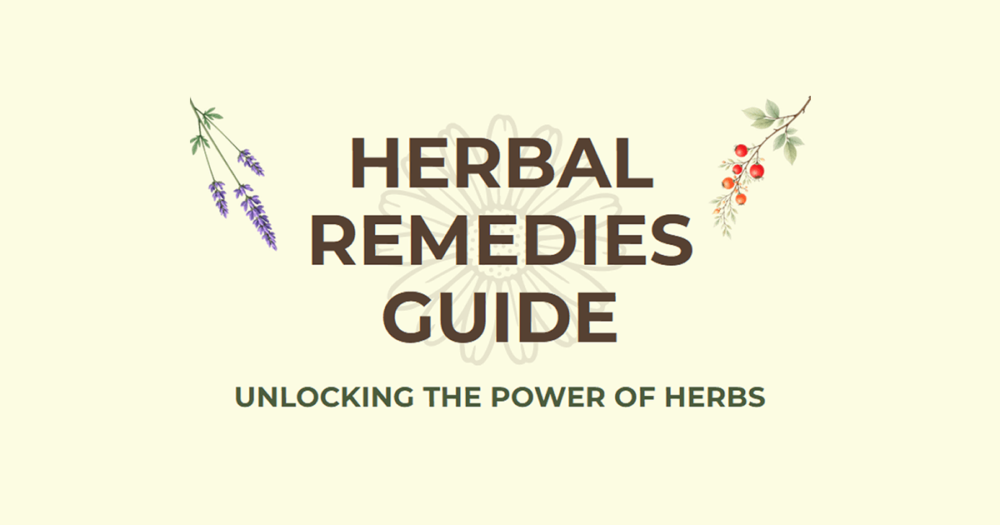

  

# Herbal Remedies Guide

> **Note**: This is a public documentation repository. The source code is maintained in a private repository.

**Live App**: [https://herbal-remedies-guide.vercel.app](https://herbal-remedies-guide.vercel.app)

**Based on the Book**: [The Little Handbook of Natural Remedies by Michael Martin](https://play.google.com/store/books/details/Michael_Martin_The_Little_Handbook_of_Natural_Reme?id=_KRNEQAAQBAJ)

An AI-powered herbal remedies chatbot and natural medicine research assistant featuring natural remedies from *The Little Handbook of Natural Remedies* by Michael Martin. This RAG (Retrieval-Augmented Generation) system provides evidence-based answers about herbal remedies, medicinal plants, traditional medicine, and botanical medicine through advanced AI technology.

## Features

- **Natural Language Question-Answering**: Ask questions about herbal remedies, medicinal plants, and traditional medicine in plain English
- **Book-Based Knowledge Source**: Queries *The Little Handbook of Natural Remedies* as primary knowledge base via vector embeddings
- **Source Citations**: Get answers with context retrieval and citations from the published handbook
- **Semantic Search**: Uses sentence transformers to find relevant information based on context, not just keywords
- **Real-time Streaming Responses**: WebSocket support for responsive, interactive conversations
- **LLM-Enhanced Answers**: Generates natural language responses with LLM expansion for questions beyond the book's scope

## Architecture

### Backend (Python FastAPI)

- **FastAPI** server with WebSocket support
- **Sentence Transformers** for semantic embeddings of *The Little Handbook of Natural Remedies*
- **LLM Integration** for context-aware response generation with source citations
- **Vector Search** with numpy-based similarity matching on book content
- **Document Processing Pipeline** for processing the handbook into vector embeddings
- **Rate Limiting** and input validation

### Frontend (React + TypeScript)

- **React 19** with TypeScript for type safety
- **Vite** for fast development and optimized builds
- **WebSocket** integration for real-time responses

### Payment & Access Control

- **Stripe Integration**: Checkout sessions for premium access
- **User Tracking**: Vercel KV storage for user access state
- **Paywall Component**: Conditional rendering based on user access status

## Key Components

### How It Works

1. **Document Ingestion**: Processes *The Little Handbook of Natural Remedies* with hash-based change detection
2. **Text Chunking**: Splits the handbook into meaningful chunks with configurable sizes
3. **Embedding Generation**: Creates semantic vectors of book content using sentence transformers
4. **Vector Storage**: Saves embeddings as numpy arrays for efficient retrieval
5. **Query Processing**: Finds relevant book sections using cosine similarity
6. **Response Generation**: Uses LLM to synthesize answers from retrieved book context, with citations
7. **LLM Expansion**: Supplements book knowledge with LLM-based expansion for broader queries

### API Endpoints

- `POST /query` - Submit questions via REST API
- `WebSocket /ws` - Real-time chat interface
- Rate limiting and input validation on all endpoints

## Performance Optimizations

- **Lazy Loading**: Heavy ML models loaded on-demand to reduce startup time
- **Vector Caching**: Hash-based cache prevents unnecessary reprocessing
- **Batch Processing**: Efficient embedding generation for multiple texts
- **Request Validation**: Input sanitization and rate limiting

## Example Queries

- "What are the benefits of turmeric?"
- "Which herbs help with inflammation?"
- "What does research say about ashwagandha for stress?"
- "How do I use ginger for digestive issues?"

## About the Book

This application is based on [The Little Handbook of Natural Remedies](https://play.google.com/store/books/details/Michael_Martin_The_Little_Handbook_of_Natural_Reme?id=_KRNEQAAQBAJ) by Michael Martin, a comprehensive guide to herbal medicine, medicinal plants, and traditional healing practices.

## Notes

All rights reserved.

**Disclaimer**: This app provides educational information only and is not a substitute for professional medical advice. Always consult a healthcare provider before using any herbal remedy or treatment. The information is based on traditional use and available research, not intended to diagnose, treat, cure, or prevent any disease.
